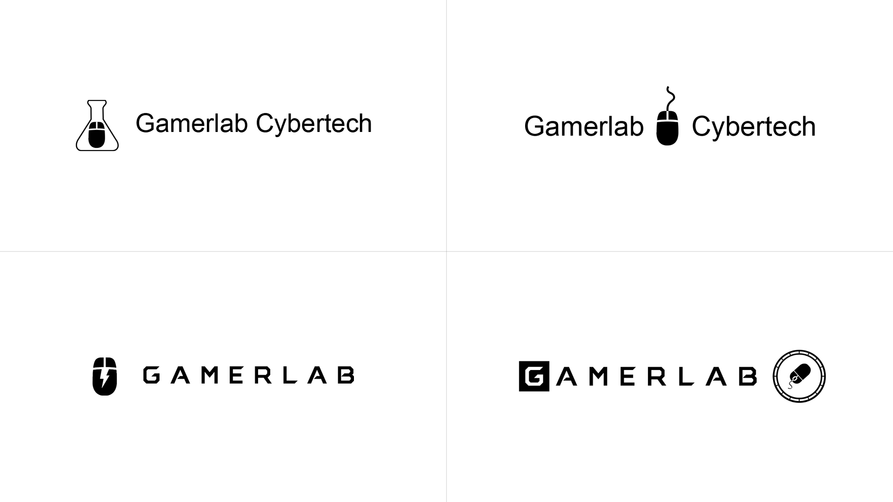
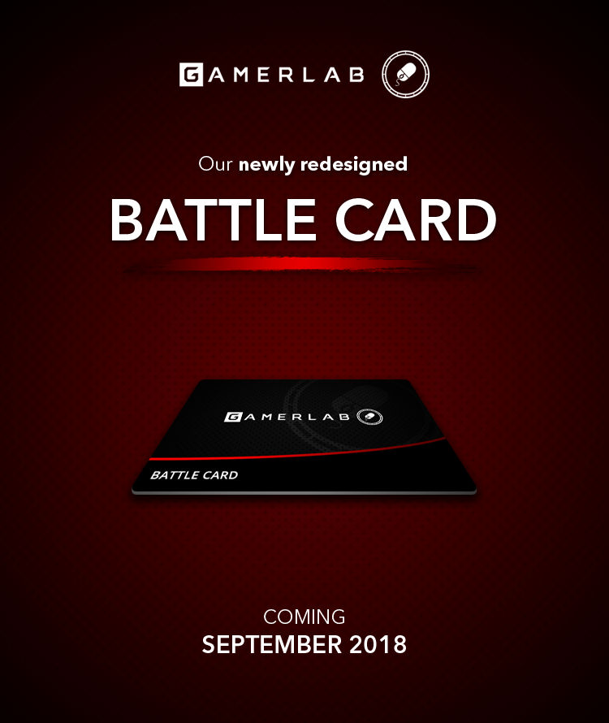
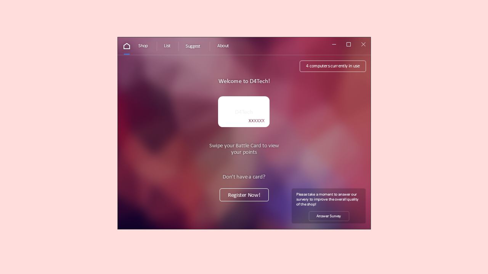
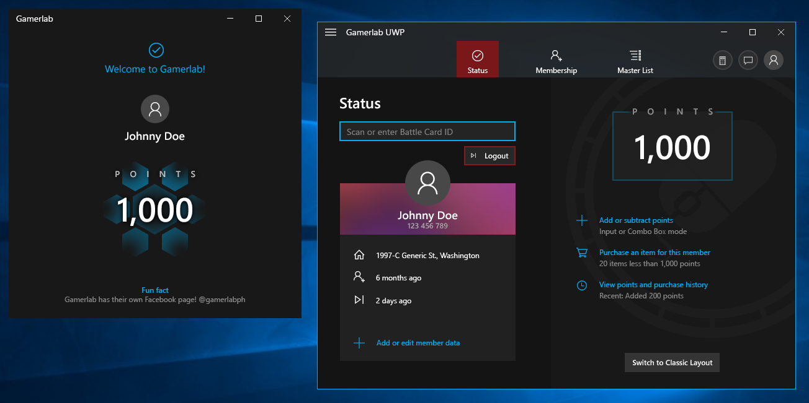

Gamerlab Cybercafe is a gaming hub located in the Philippines, designed for gaming enthusiasts. Founded in October 2017, it offers an affordable space for gamers to rent computers and enjoy their favorite video games. Through its exclusive Gamerlab Battle Card, members can earn and load points, which can be redeemed for additional playtime or used to purchase video games.

I joined as the founding designer in which I helped shaped the identity of Gamerlab. From creating the logo to designing promotional posters, it helped me learn the ins and outs of graphic design and branding. I also led the development of their point-of-sale (POS) system which managed Battle Card memberships using .NET and C#.

---

# Logo

In late October 2017, I was tasked with designing a logo that would fit Gamerlab's gaming vibes. Within a few days, I came up with three logo concepts that relate to the name using the computer mouse as its main feature. While brainstorming, I came up with the idea of a mouse running on a wheel, I thought it was quite random at first but it eventually stuck. I spiced up the final logo with the squared letter G, and that's how the final logo came to life.

_Design iterations of Gamerlab's logo._

_Three logomark variants of Gamerlab._

---

# Posters

A month after the shop's official opening, I was tasked to create the first poster for Gamerlab which was celebrating Christmas with free prepaid cards. Throughout the years, I designed posters relating to holidays and events. Here are some of the best posters that I made during that time.

---

# Software Design

In addition to graphic design, I also developed Gamerlab's point-of-sale (POS) software which manages data of Battle Card members using .NET Framework and C#. This project marked as my first exposure to software development.

_Early concept design of Gamerlab's client for customers._

_Concept design of Gamerlab's point-of-sale (POS) software made in Photoshop._
