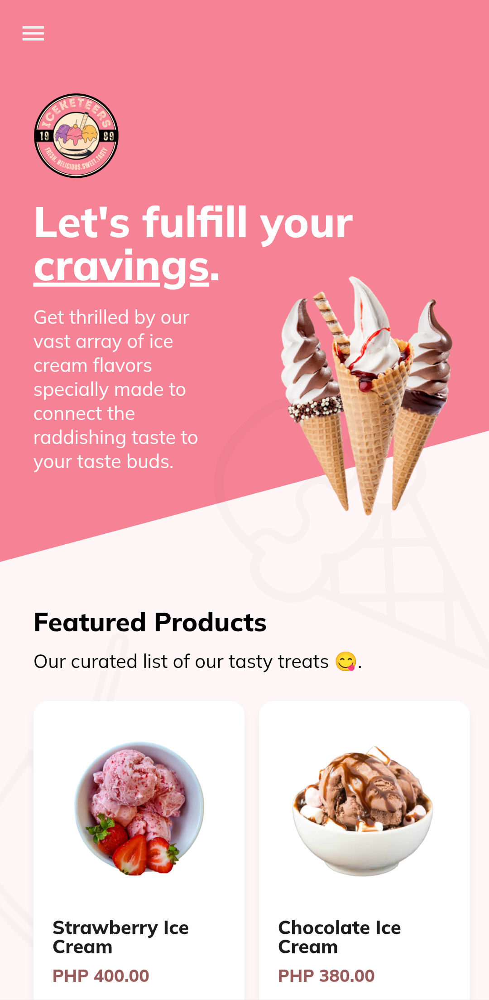
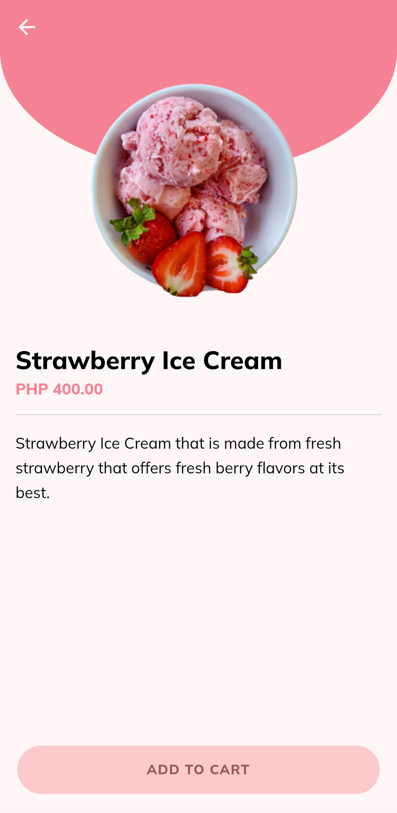
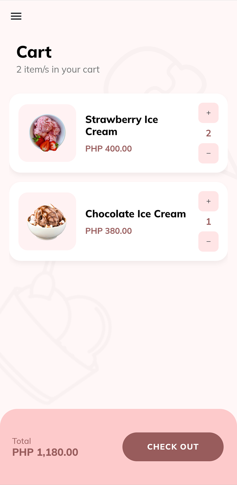
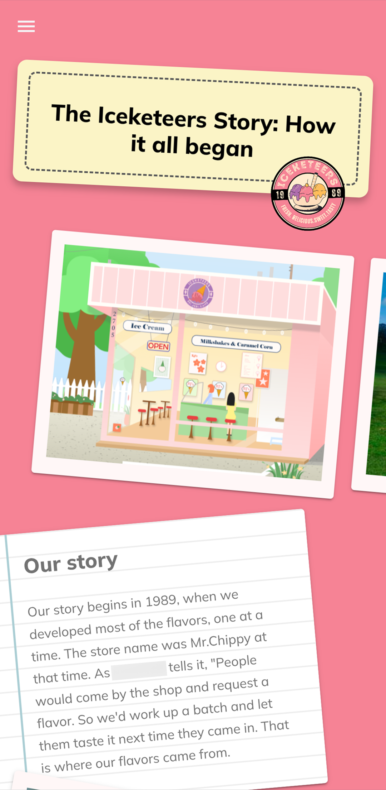
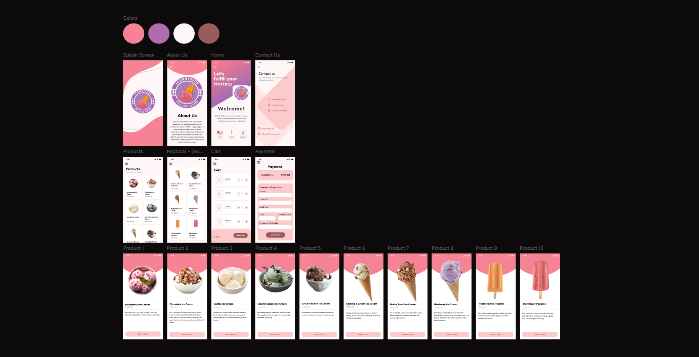

Iceketeers is an e-commerce mobile application offering a seamless and delightful experience for ice cream lovers. Browse a delectable selection of ice cream, add your favorite treats to the cart, and proceed with a smooth and secure checkout process, all from the convenience of your mobile device.

This project was made and developed by team of three passionate people for a small project. I was responsible for both the design and development aspects of Iceketeers. I spearheaded the creation of the intuitive and aesthetically pleasing user interface, and contributed to the application's core functionality, which was built using the Ionic framework and powered by Firebase for its backend services.

---

# Screens

_The screens of the actual Iceketeers app working on Android._

---

# Design Prototyping

_Early design prototype of the Iceketeers app made in Figma._
