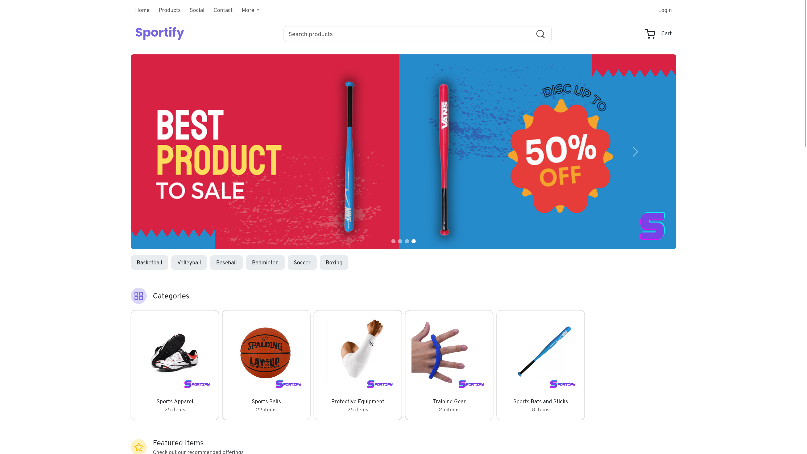
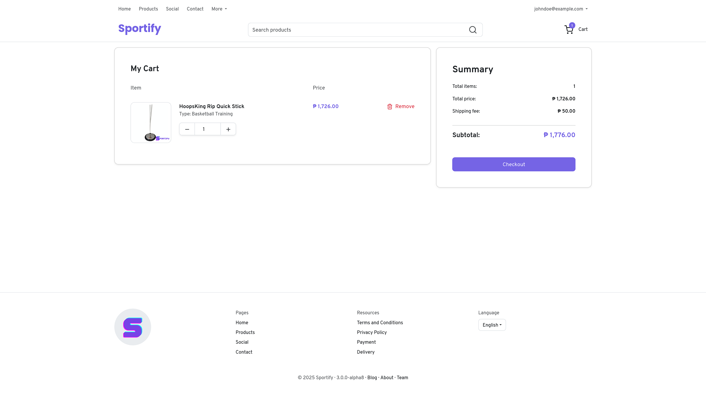
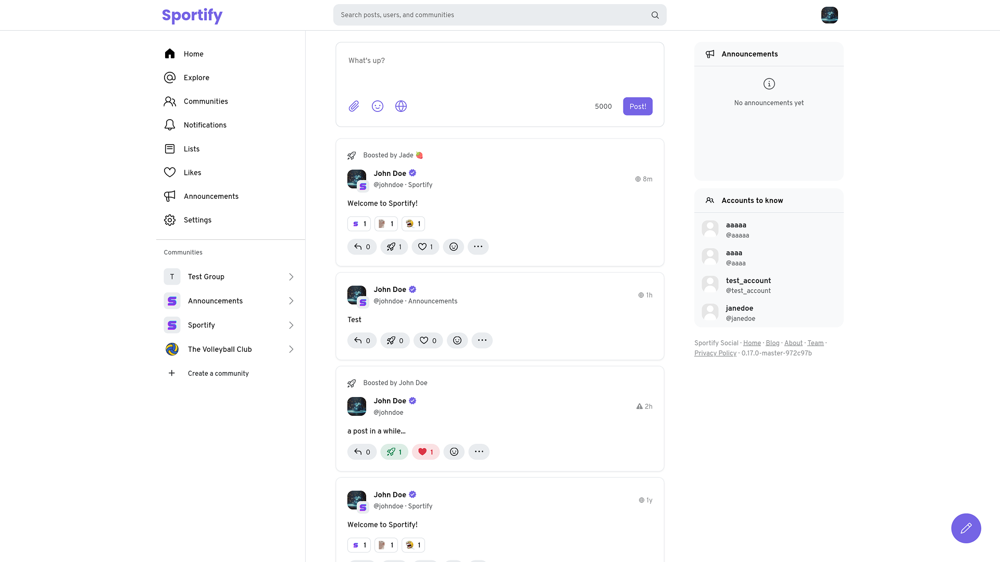
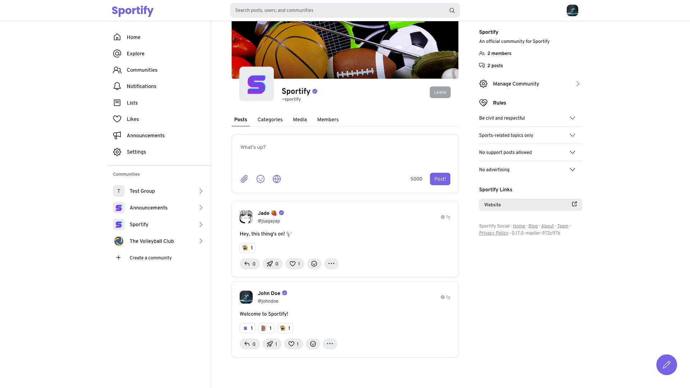

Sportify is an e-commerce and social networking platform designed for sports enthusiasts. It offers a wide selection of sports products from various brands and manufacturers. In addition to shopping, Sportify provides a community space where fans can share their passion for sports. The 'Communities' feature allows users to personalize their experience and connect with like-minded individuals.

The project originally began as a group assignment with a static first version. The second version introduced a major redesign along with the addition of a backend, while the third version involved a complete overhaul. I was primarily responsible for the last two versions, handling everything from the website redesign to the development of the new backend.

---

# Sportify Store

The e-commerce component is the core feature of Sportify, offering a diverse range of products from various brands and manufacturers. Users can easily add items to their cart and complete the checkout process with minimal effort.

_Homepage of Sportify showing the banner and product categories._

_The Cart section showing one item added._

---

# Sportify Social

Sportify also offers a community space for sports enthusiasts. Users can post text, images, and even create their own communities, each with their own rules and etiquette. Users can curate their own experience by following users and joining communities.

_Homepage of Sportify Social showing recent posts._

_The official Sportify community with a few posts._
